# STACSYAK

### (Update) STACSYAK API NOT IN USE ANYMORE

This project implements the client-side for a new messaging service named StacsYak. It lets users post messages, called Yaks, to a server and read the Yaks other people post. 

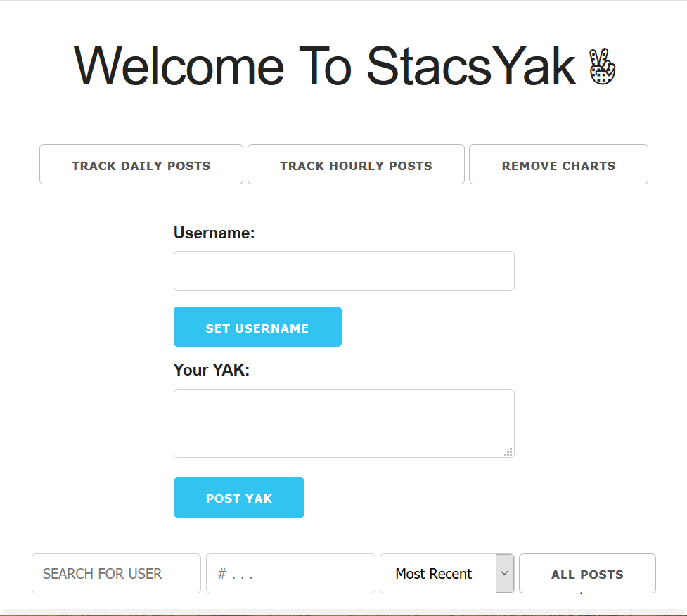
 

Functionalities:
* allows users to see all the Yaks that are currently available from the server. Polls server every 5s to get and display the updated list of Yaks from the server without reloading the page

 

* allows users to post Yaks, re-display the updated list of Yaks from the server without reloading the page
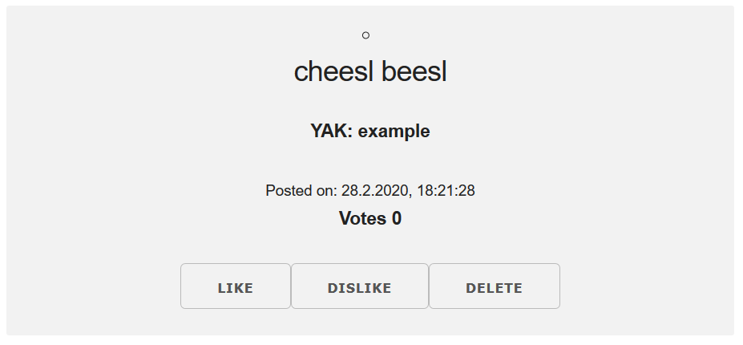
 

* Allow users to delete Yaks they have created. After successfully deleting a Yak, re-display the updated list of Yaks from the server without reloading the page. E.g. Error message deleting post that is not yours: 
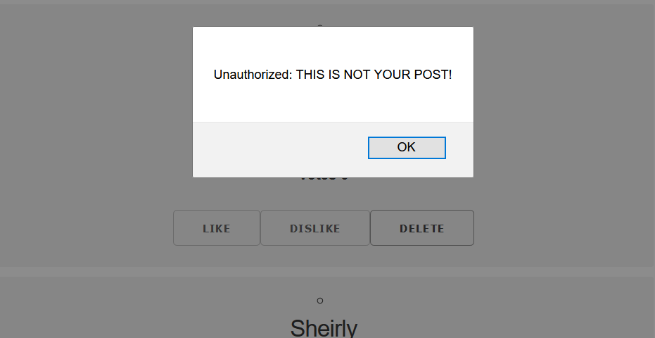
 

* Allow users vote Yaks up and down. After successfully up/down voting a Yak, re-display the updated list of Yaks from the server without reloading the page.
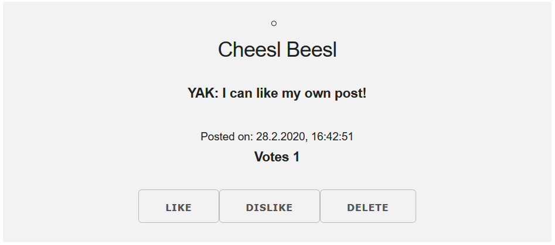
 

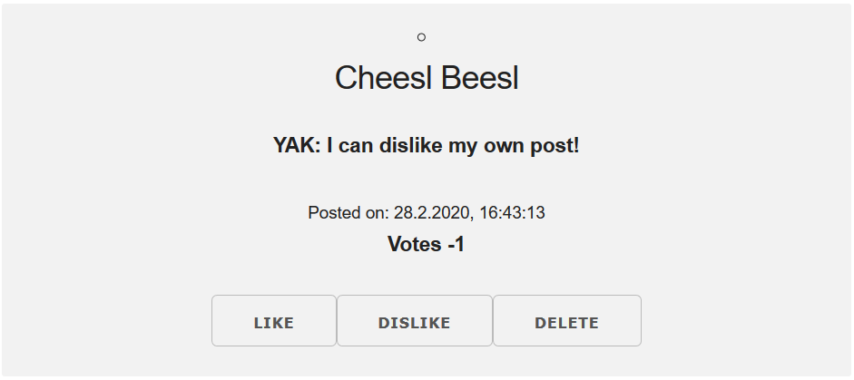
 

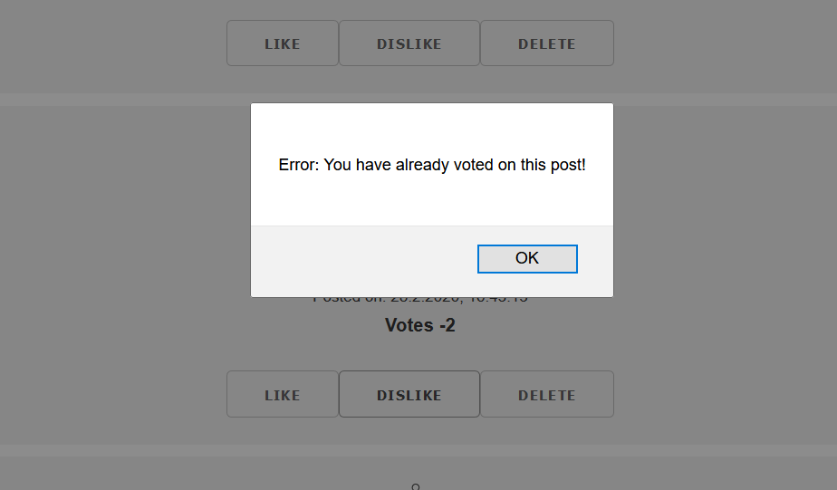
 

* Allow users change their nickname. After successfully changing the nickname, display it in the interface without reloading the page
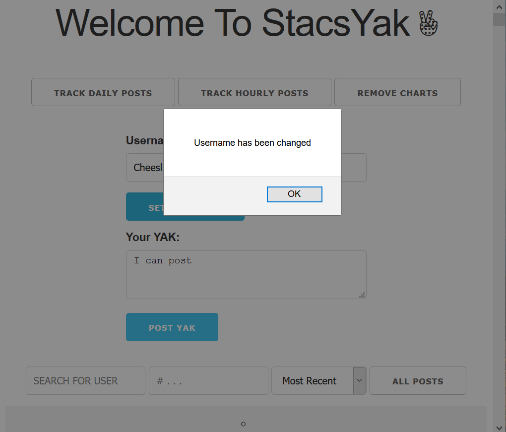
 

Filter 
* Allow users to filter current Yaks based on nichname, hashtags, number of votes and timestamp
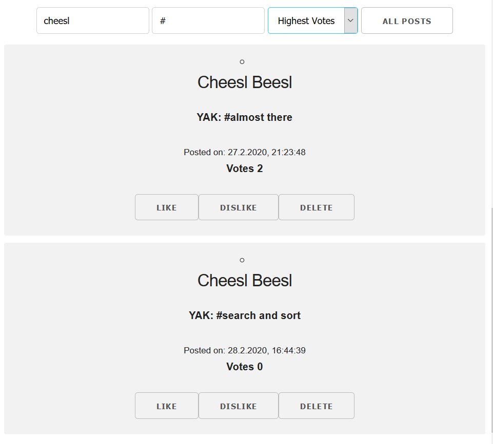
 

Barchart
* Display barchart showing the number of Yaks poster PER HOUR over the last 2 days
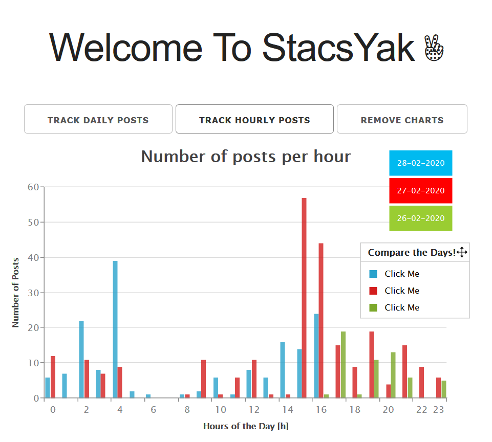
 

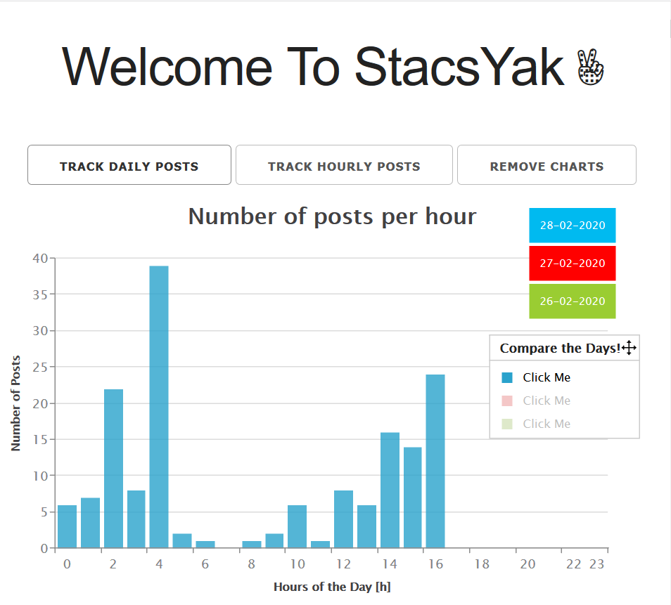
 

* Display barchart showing the number of Yaks poster PER DAY 
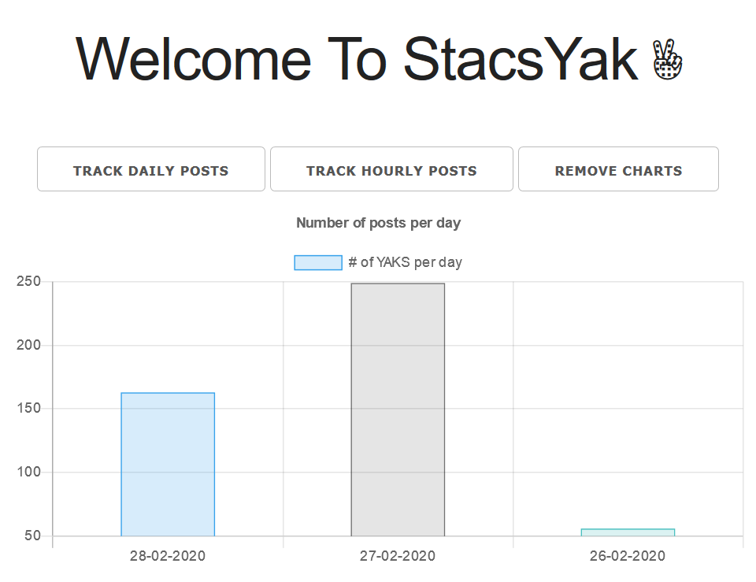
 

